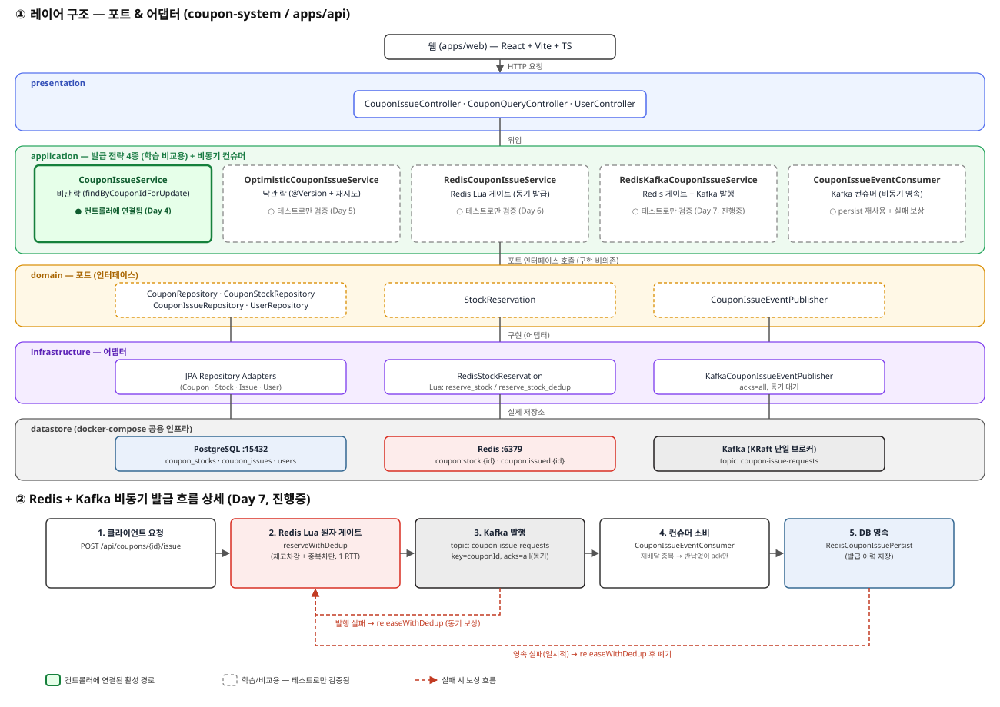

# coupon-system (monorepo)

선착순 쿠폰 발급 시스템 — 백엔드 역량 강화용 사이드 프로젝트.
동시성 제어, AOP, Kafka, Spring Batch, Kubernetes, 모니터링을 단계적으로 학습한다.

## 구조

```
coupon-system/
├── apps/
│   ├── api/          # 백엔드 — Spring Boot 3.5 + Kotlin, 레이어드 아키텍처
│   └── web/          # 프론트 — Vite + React + TS, atomic design
├── docker-compose.yml  # 공용 인프라 (PostgreSQL + Redis)
└── .sdkmanrc           # JDK/Gradle 툴체인 (레포 전체)
```

## 공용 인프라 (레포 루트에서 실행)

```bash
docker compose up -d        # PostgreSQL(호스트 15432) + Redis(6379)
docker compose ps           # healthy 확인
docker compose down         # 종료 (데이터 유지)
```

## 백엔드 (apps/api)

```bash
sdk env                     # .sdkmanrc 기준 JDK 21 적용 (최초 1회 sdk env install)
cd apps/api && ./gradlew build   # 인프라가 떠 있어야 통과
cd apps/api && ./gradlew bootRun
```

## 프론트엔드 (apps/web)

```bash
cd apps/web && npm install
cd apps/web && npm run dev
```
디자인 시스템 기준 문서: [apps/web/DESIGN.md](apps/web/DESIGN.md) (Uber, 흑백 + pill).

## 아키텍처

`apps/api`는 도메인에 포트(인터페이스)를 두고 infrastructure에서 어댑터로 구현하는 가벼운 포트-어댑터(헥사고날) 스타일 레이어드 아키텍처를 따른다.



**레이어 구조 (위 그림 ①)**

- `presentation` — 얇은 컨트롤러. 검증된 요청을 서비스에 위임하고 DTO로 변환만 한다.
- `application` — 유스케이스 서비스. 특히 쿠폰 발급은 **동시성 제어 전략 4종을 나란히 구현**해두었다 — 이 프로젝트 자체가 전략 간 트레이드오프를 비교 학습하는 것이 목적이라, 하나로 정리하지 않고 의도적으로 병렬 유지 중이다.
  - `CouponIssueService` (비관 락, `SELECT … FOR UPDATE`) — 현재 `/api/coupons/{id}/issue`에 실제로 연결된 유일한 경로
  - `OptimisticCouponIssueService` (`@Version` 낙관 락 + 재시도 루프)
  - `RedisCouponIssueService` (Redis Lua 원자 게이트, 동기 발급)
  - `RedisKafkaCouponIssueService` + `CouponIssueEventConsumer` (Redis 게이트로 선차단 후 Kafka로 비동기 발행/소비)
  - 나머지 세 경로는 컨트롤러에는 연결되어 있지 않고, 각자의 동시성 테스트로만 불변식(초과발급 없음 등)을 검증한다.
- `domain` — 엔티티와 포트 인터페이스(`StockReservation`, `CouponIssueRepository`, `CouponIssueEventPublisher` 등). 구현 기술에 의존하지 않는다.
- `infrastructure` — 포트의 실제 구현체(JPA 어댑터, `RedisStockReservation`, `KafkaCouponIssueEventPublisher`)와 PostgreSQL/Redis/Kafka 연동.

**Redis + Kafka 비동기 발급 흐름 (위 그림 ②, Day 7 진행 중)**

1. 클라이언트 요청 → **Redis Lua 원자 게이트**(`reserveWithDedup`)가 재고 차감과 중복 발급 차단을 한 번의 스크립트 실행으로 원자 처리
2. 게이트를 통과한 발급 의도를 **Kafka**(`coupon-issue-requests`, key=couponId, `acks=all` 동기 대기)로 발행 — 발행 자체가 실패하면 즉시 `releaseWithDedup`으로 슬롯을 반납하는 동기 보상
3. **컨슈머**(`CouponIssueEventConsumer`)가 이벤트를 소비해 DB에 발급 이력을 영속 — 일시적 실패는 반납 후 폐기, 재배달로 인한 DB unique 위반은 이미 정당하게 슬롯을 보유한 것이므로 반납 없이 ack만 하여 초과발급을 막는다(at-least-once 멱등 처리)

**진행 상황** — 1주차(동시성 제어)는 완료, 2주차(Kafka/EDA)는 핵심 흐름 구현·테스트까지 진행됨. 3주차(Spring Batch)·4주차(Kubernetes+모니터링)는 아직 착수 전이라 위 다이어그램에는 표시하지 않았다.

## 학습 로드맵

- **1주차** 동시성 제어 + Spring AOP (분산 락)
- **2주차** Kafka / Event-Driven Architecture
- **3주차** Spring Batch (대용량 정산)
- **4주차** Kubernetes + Prometheus/Grafana 모니터링
